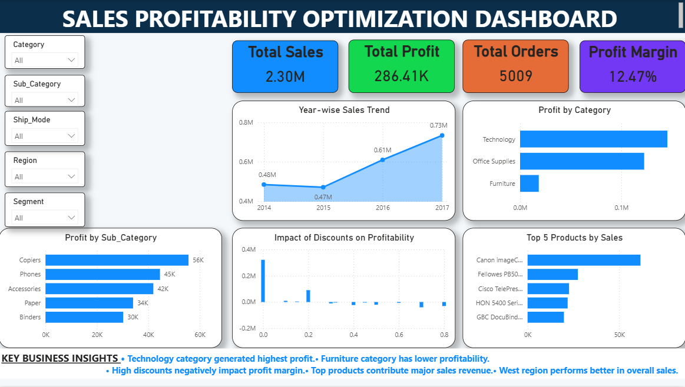

# Sales Profitability Optimization Dashboard

## Tools Used
- Excel
- SQL
- Power BI

## Project Objective
Analyze sales, profit, customer behavior, regional performance and product profitability.

## Key Insights
- Technology category generated highest profit
- High discounts negatively affected profitability
- West region contributed highest sales
- Top customers generated major revenue

# Dashboard Screenshots

## Executive Summary

## Product Analysis

## Customer & Region Analysis

