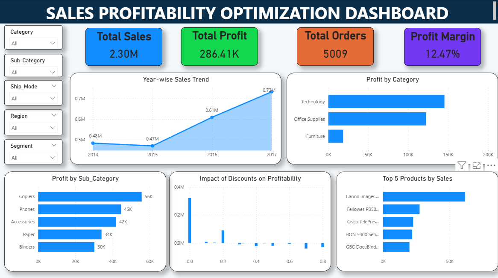
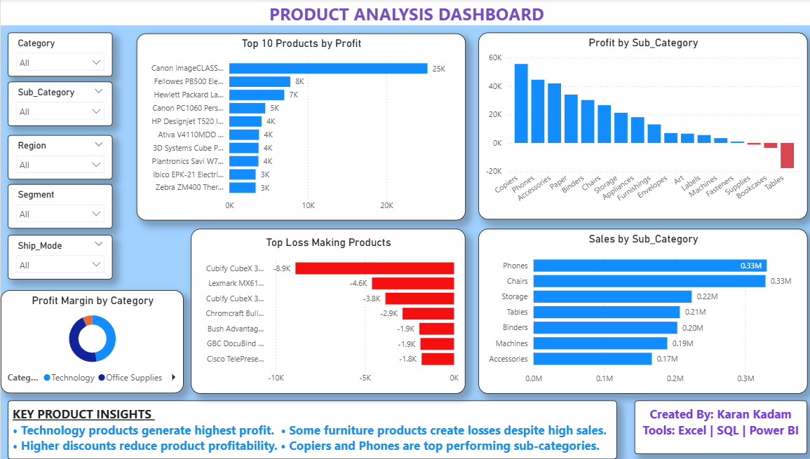
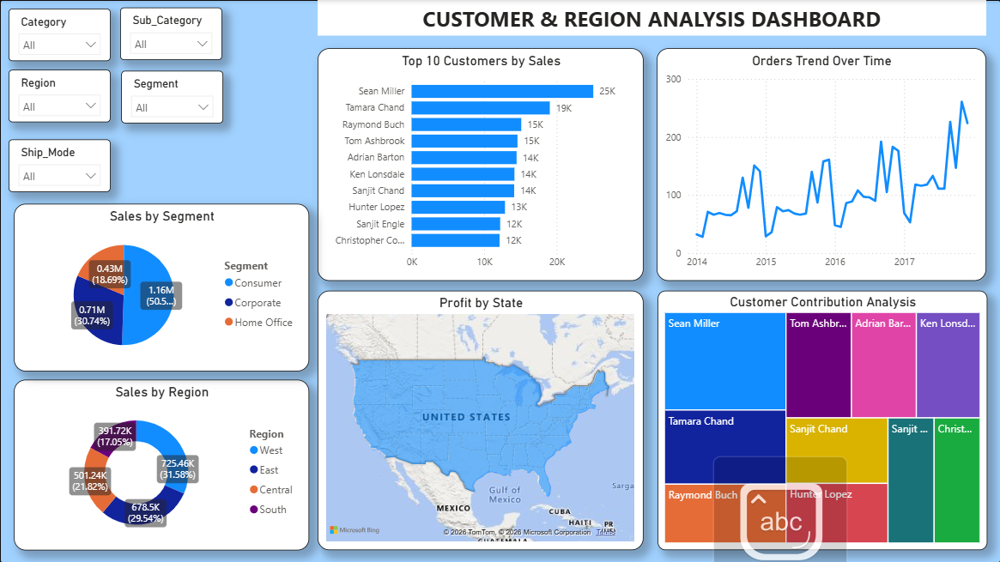

# 📊 Sales Profitability Optimization Dashboard

> **End-to-end analytics project** on 9,993 retail transactions to uncover profit leakage, identify top-performing segments, and deliver actionable business recommendations.



---

## 🧩 Problem Statement

A retail company was generating **$2.29M in sales** but only retaining **12.47% as profit** — well below industry benchmarks. Key questions:

- Which **products and categories** are killing margins?
- How much profit is being lost to **excessive discounting**?
- Which **regions and customer segments** drive the most value?
- What **data-driven actions** can improve profitability?

---

## 🛠️ Tools & Technologies

| Tool | Purpose |
|------|---------|
| Microsoft Excel | Data cleaning, EDA, pivot analysis |
| MySQL | 23 SQL queries — aggregations, window functions, CTEs |
| Power BI | 3-page interactive dashboard with KPI cards & slicers |

---

## 📁 Dataset Overview

| Metric | Value |
|--------|-------|
| Total Rows | 9,993 orders |
| Unique Orders | 5,009 |
| Unique Customers | 793 |
| Time Period | Jan 2014 – Dec 2017 |
| Regions | West, East, Central, South |
| Total Sales | $2,297,200 |
| Total Profit | $286,397 |
| Overall Profit Margin | 12.47% |

---

## 🔍 Key Business Insights

### 💰 Category Profitability

| Category | Total Profit | Profit Margin | Share of Total Profit |
|----------|-------------|---------------|----------------------|
| Technology | $145,455 | 17.39% | 50.8% |
| Office Supplies | $122,491 | 17.03% | 42.8% |
| **Furniture** | **$18,463** | **2.49%** | **6.4%** |

- **Technology** generates over **50% of all profit** despite not being the highest sales category
- **Furniture** has a critically low 2.49% margin — Tables sub-category alone lost **$17,725**

### 🌍 Regional Performance

| Region | Share of Sales |
|--------|---------------|
| West | 31.6% |
| East | 29.5% |
| Central | 21.8% |
| South | 17.1% |

- **West** leads in revenue but Central region has the weakest profit-to-sales ratio
- Several states in the Central region show **negative profit** despite decent order volumes

### 📉 Loss-Making Sub-Categories

| Sub-Category | Total Loss |
|-------------|-----------|
| Tables | -$17,725 |
| Bookcases | -$3,473 |
| Supplies | -$1,189 |

---

## 💡 Business Recommendations

1. **Cap discounts at 20%** across all categories — especially Furniture — to recover the 14.5% margin gap
2. **Phase out or reprice Tables and Bookcases** — both sub-categories are loss-making at current price points
3. **Double down on Technology** — highest margin category (17.39%) with strong growth potential
4. **Shift Central region strategy** — high order volume but lowest profitability; review pricing and logistics costs
5. **Protect top customers** — focus retention efforts on the top 10% of customers who drive disproportionate revenue

---

## 📊 Dashboard Pages

### Executive Summary


### Product Analysis


### Customer & Region Analysis


---

## 🗂️ Project Structure

```
📦 Sales-Profitability-Optimization-Dashboard
 ┣ 📄 README.md                            ← You are here
 ┣ 📊 Sales_Profitability_Dashboard.pbix   ← Power BI file (open in Power BI Desktop)
 ┣ 🗃️ Sales_Profitability_SQL_Queries.sql  ← 23 SQL queries used in analysis
 ┣ 📂 Superstore_Cleaned.csv              ← Cleaned dataset (9,994 rows)
 ┣ 🖼️ Executive_Summary.png
 ┣ 🖼️ Product_Analysis.png
 ┗ 🖼️ Customer_Region_Analysis.png
```

---

## 🚀 How to Explore This Project

1. **Power BI Dashboard** → Download `Sales_Profitability_Dashboard.pbix`, open in Power BI Desktop, use slicers to filter by Region / Category / Year
2. **SQL Analysis** → Run `Sales_Profitability_SQL_Queries.sql` in MySQL Workbench against the CSV data
3. **Raw Data** → `Superstore_Cleaned.csv` ready to use — no additional cleaning needed

---

## 🧠 SQL Highlights

This project includes **23 SQL queries** covering:
- Aggregations (Sales, Profit, Margin by Category/Region/Segment)
- **Window Functions** — `RANK() OVER`, Running Sales Total with `SUM() OVER`
- **CTEs** — Top product per category using `WITH` clause
- Discount impact analysis, loss-making product identification, YoY trends

---

## 👤 Connect With Me

**Karan Kadam** — Aspiring Data Analyst | SQL • Power BI • Excel • Tableau • Python

📧 karankadam443@gmail.com  
🔗 [GitHub Profile](https://github.com/datawithkaran)

---

*⭐ If this project helped you, please star the repository!*
